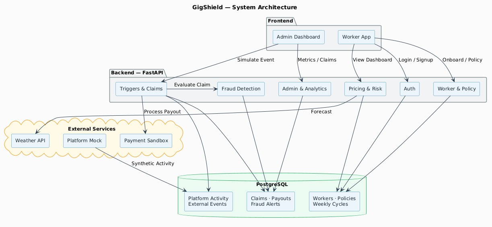
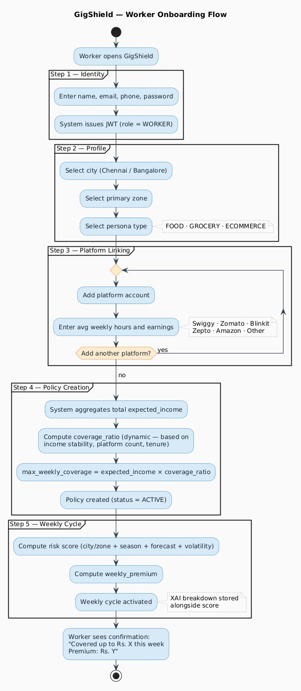
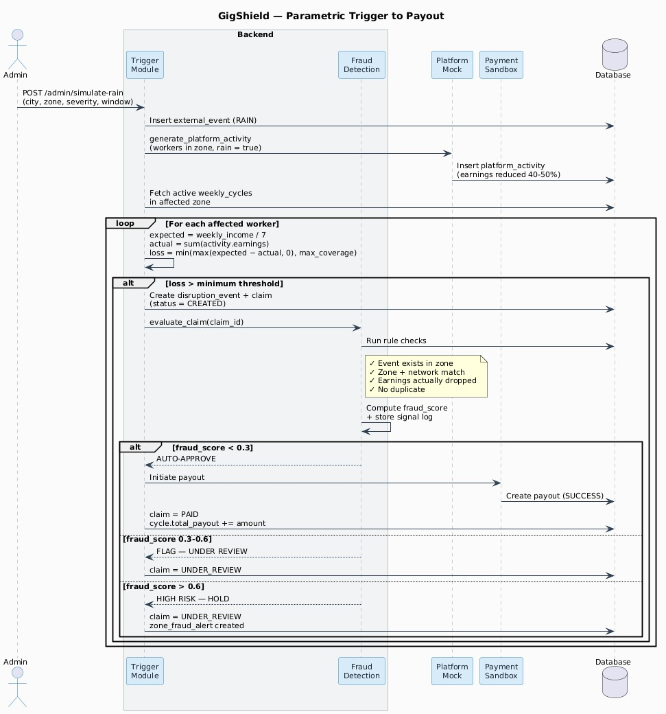
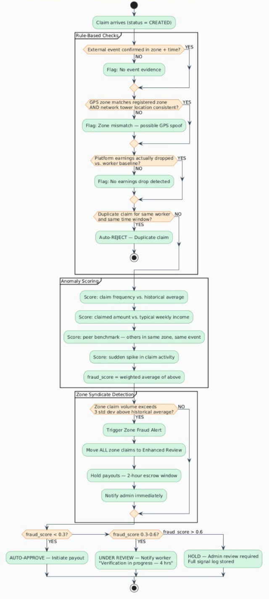
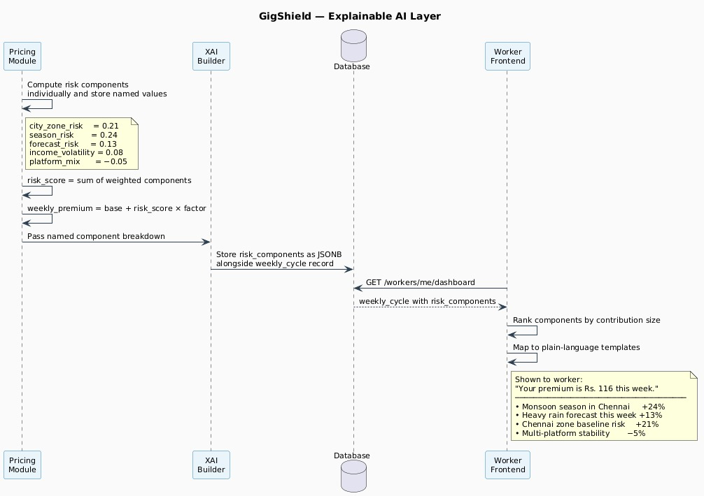
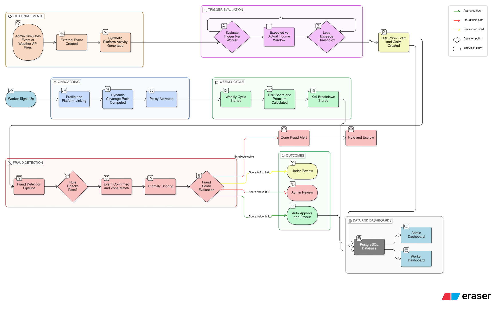

# SurelyAI — AI-Powered Parametric Income Insurance for India's Gig Delivery Workers

**Guidewire DEVTrails 2026 | University Hackathon Submission**

---

## Table of Contents

- [SurelyAI — AI-Powered Parametric Income Insurance for India's Gig Delivery Workers](#surelyai--ai-powered-parametric-income-insurance-for-indias-gig-delivery-workers)
  - [Table of Contents](#table-of-contents)
  - [1. Executive Summary](#1-executive-summary)
  - [2. Problem Context and Market Reality](#2-problem-context-and-market-reality)
  - [3. Our Persona and Scope](#3-our-persona-and-scope)
    - [Primary Persona](#primary-persona)
    - [Persona-Specific Disruption Parameters](#persona-specific-disruption-parameters)
    - [What Is Covered](#what-is-covered)
    - [What Is Explicitly Excluded](#what-is-explicitly-excluded)
  - [4. Solution Architecture Overview](#4-solution-architecture-overview)
    - [Key Architectural Decisions](#key-architectural-decisions)
  - [5. Core Feature Breakdown](#5-core-feature-breakdown)
    - [5.1 Onboarding and Policy Setup](#51-onboarding-and-policy-setup)
    - [5.2 AI-Powered Weekly Risk Pricing](#52-ai-powered-weekly-risk-pricing)
    - [5.3 Parametric Trigger and Automated Claims](#53-parametric-trigger-and-automated-claims)
    - [5.4 Intelligent Fraud Detection](#54-intelligent-fraud-detection)
    - [5.5 Analytics Dashboard](#55-analytics-dashboard)
  - [6. Adversarial Defense and Anti-Spoofing Strategy](#6-adversarial-defense-and-anti-spoofing-strategy)
    - [6.1 The Differentiation: Genuine Stranded Worker vs. Bad Actor](#61-the-differentiation-genuine-stranded-worker-vs-bad-actor)
    - [6.2 The Data Points: Beyond Basic GPS](#62-the-data-points-beyond-basic-gps)
    - [6.3 The UX Balance: Protecting Honest Workers](#63-the-ux-balance-protecting-honest-workers)
  - [7. Explainable AI (XAI) Layer](#7-explainable-ai-xai-layer)
    - [Why Explainability Matters Here](#why-explainability-matters-here)
    - [How the XAI Layer Works](#how-the-xai-layer-works)
  - [8. Data Model](#8-data-model)
    - [Core Tables](#core-tables)
  - [9. API Design and Integration Capabilities](#9-api-design-and-integration-capabilities)
    - [Auth Endpoints](#auth-endpoints)
    - [Worker Endpoints](#worker-endpoints)
    - [Admin Endpoints](#admin-endpoints)
    - [External Integrations](#external-integrations)
  - [10. Tech Stack and Infrastructure](#10-tech-stack-and-infrastructure)
    - [Backend](#backend)
    - [Frontend](#frontend)
    - [Database](#database)
    - [Hosting (Optional but Configured)](#hosting-optional-but-configured)
    - [Shared Contract](#shared-contract)
  - [11. Novelty and Differentiators](#11-novelty-and-differentiators)
    - [1. Multi-Category, Multi-Platform Income Reconciliation](#1-multi-category-multi-platform-income-reconciliation)
    - [2. Coordinated Syndicate Detection (Zone Fraud Alerts)](#2-coordinated-syndicate-detection-zone-fraud-alerts)
    - [3. Explainable AI as a Core Feature, Not an Add-on](#3-explainable-ai-as-a-core-feature-not-an-add-on)
    - [4. Parametric Simulator for Admins](#4-parametric-simulator-for-admins)
    - [5. Multi-Signal Fraud Defense](#5-multi-signal-fraud-defense)
  - [12. Weekly Premium Model — Financial Logic](#12-weekly-premium-model--financial-logic)
    - [Why Weekly?](#why-weekly)
    - [Premium Calculation Example](#premium-calculation-example)
    - [Loss Ratio Monitoring](#loss-ratio-monitoring)
  - [13. Development Plan and Team Split](#13-development-plan-and-team-split)
    - [Feature Branches](#feature-branches)
    - [Contract-First Development](#contract-first-development)
    - [Phase Timeline](#phase-timeline)
    - [Smoke Test Sequence](#smoke-test-sequence)
  - [14. Architecture and Flow Diagrams](#14-architecture-and-flow-diagrams)
    - [14.1 System Component Architecture](#141-system-component-architecture)
    - [14.2 Worker Onboarding Flow](#142-worker-onboarding-flow)
    - [14.3 Parametric Trigger to Payout — Sequence](#143-parametric-trigger-to-payout--sequence)
  - [15. Fraud Detection and Explainability Diagrams](#15-fraud-detection-and-explainability-diagrams)
    - [15.1 Fraud Detection and Anti-Spoofing Pipeline](#151-fraud-detection-and-anti-spoofing-pipeline)
    - [15.2 Explainable AI Layer — Premium Breakdown Flow](#152-explainable-ai-layer--premium-breakdown-flow)
    - [15.3 End-to-End System Workflow (Overview)](#153-end-to-end-system-workflow-overview)

---

## 1. Executive Summary

SurelyAI is an AI-enabled, parametric income insurance platform built specifically for platform-based delivery partners in India. It targets workers across food delivery (Swiggy, Zomato), grocery and quick commerce (Blinkit, Zepto, Instamart), and e-commerce logistics (Amazon, Flipkart) — covering all three sub-categories under a unified multi-category architecture, with the design intentionally structured to support multi-worker, multi-platform scaling from day one.

The platform protects gig workers from income loss caused strictly by external, measurable disruptions: extreme weather events, civic curfews, and local strikes. It does not cover health, accidents, or vehicle repairs. Coverage is structured on a weekly pricing cycle, matching the operational rhythm of gig workers.

The core value proposition is zero-touch claim processing. When a disruption occurs and crosses a parametric threshold, the system automatically detects the event, computes the estimated income loss, evaluates fraud signals, and initiates a payout — all without the worker filing a single form. Workers simply see a notification: "We detected heavy rain in your zone. A payout of Rs. X has been processed."

The platform is differentiated by three technical capabilities that go well beyond a basic insurance CRUD app:

- A multi-signal, behavioural fraud detection engine that defends against GPS spoofing, coordinated syndicate fraud, and market crash exploitation scenarios.
- An Explainable AI layer that shows workers and admins precisely why a premium was set or a claim was approved/flagged — not a black box.
- A parametric simulator that lets admins tune trigger thresholds against historical data before deploying changes, reducing basis risk.

---

## 2. Problem Context and Market Reality

India's gig delivery workforce — estimated at over 15 million workers across major platforms — operates without a financial safety net. These workers are paid per order, have no guaranteed salary, and bear the full weight of income volatility caused by external events entirely outside their control.

The income impact is well-documented:

- A single heavy rain event in a metro city can reduce a food delivery rider's daily earnings by 40–50%, as platforms throttle supply for safety while demand spikes.
- Unplanned curfews and local strikes can zero out an entire evening shift, which for many workers represents their peak earning window.
- Quick-commerce riders in Bangalore face pincode-level "no delivery" flags during flooding events, making entire neighbourhoods inaccessible for hours.
- Extended disruption events — such as multi-day flooding during monsoon — can cause 20–30% monthly income loss.

Traditional insurance products are entirely inaccessible to this population: premiums are monthly or annual, underwriting requires stable income documentation, and claim processes require manual filing, receipts, and adjuster reviews. None of this fits the weekly, informal, gig-economy reality.

Parametric insurance is the right answer. Instead of measuring actual damage and then evaluating a subjective claim, a parametric product pays out automatically when a pre-agreed, objectively measurable condition is crossed — for example, rainfall above a threshold in the worker's zone during their shift. This model eliminates claim delay, adjuster costs, and the information asymmetry that makes traditional insurance fail for gig workers.

SurelyAI brings parametric insurance to the gig economy with AI-powered pricing and fraud defense that makes the economics viable at scale.

---

## 3. Our Persona and Scope

### Primary Persona

Our platform covers workers across all three delivery sub-categories — food, grocery/quick-commerce, and e-commerce — under a single architecture. The core persona is:

> A platform-based delivery partner working in a metro city (such as Chennai or Bangalore), operating across one or more delivery apps, paid per order on a weekly earnings cycle. Their income is vulnerable to environmental disruptions (rain, flooding, extreme heat), civic disruptions (curfews, strikes), and platform-side events (app outages, forced zone closures).

This is deliberately a multi-category persona. A single worker in practice often operates across Swiggy for food and Blinkit for grocery in the same week. Insuring only one platform misses half their income picture and creates perverse incentives for fraud.

### Persona-Specific Disruption Parameters

| Sub-Category | City Focus | Key Disruptions | Trigger Signals |
|---|---|---|---|
| Food (Swiggy, Zomato) | Chennai | Heavy rain, waterlogging, night curfew | Rainfall index > threshold, curfew flag, evening shift overlap |
| Grocery / Q-Commerce (Blinkit, Zepto) | Bangalore | Urban flooding, dark store outages, pincode-level closure | Zone service status, rainfall index, store availability flag |
| E-Commerce (Amazon, Flipkart) | Both | Strikes, broad curfews, infrastructure disruptions | Strike/curfew events, route-level blockage |

### What Is Covered

- Loss of income caused by: extreme rainfall/flooding, severe AQI events, civic curfews, local strikes, platform-mandated zone closures.
- Coverage is computed against the worker's expected weekly income, capped at a maximum weekly coverage amount (threshold of expected income).

### What Is Explicitly Excluded

- Health insurance, accident medical bills, or hospitalization.
- Vehicle repair, maintenance, or damage.
- Income loss from personal choice (voluntary offline time, self-imposed breaks).

---

## 4. Solution Architecture Overview

SurelyAI is structured as a monolithic FastAPI backend with clear internal module separation, a React + Vite SPA frontend, and a PostgreSQL database hosted on Supabase or Railway. The architecture is designed to be understandable and demo-able within the hackathon scope while being structurally honest about what a production system would require.

```
+-------------------------------+
|         React Frontend         |
|  Worker Dashboard / Onboarding |
|  Admin Dashboard / Simulator   |
+---------------+---------------+
                |
         REST JSON API
         /api/v1/...
                |
+---------------v---------------+
|        FastAPI Backend         |
|  +----------+ +-------------+ |
|  |   Auth   | |  Worker /   | |
|  |  Module  | |  Platform / | |
|  +----------+ |  Policy     | |
|               +-------------+ |
|  +----------+ +-------------+ |
|  | Pricing  | |  Events /   | |
|  |   Risk   | |  Triggers / | |
|  |  Module  | |  Claims     | |
|  +----------+ +-------------+ |
|  +----------+ +-------------+ |
|  |  Fraud   | |   Admin /   | |
|  | Detection| |  Analytics  | |
|  +----------+ +-------------+ |
+---------------+---------------+
                |
+---------------v---------------+
|          PostgreSQL DB         |
|  (Supabase / Railway / Neon)   |
+-------------------------------+
                |
   External Integrations
+------+  +----------+  +-------+
|Weather|  | Platform |  |Payment|
|  API  |  |  Mock    |  | Mock  |
+------+  +----------+  +-------+
```

### Key Architectural Decisions

- **Monolithic service with module separation:** For the hackathon, this avoids microservice orchestration overhead while keeping code organized for future splitting.
- **JWT-based auth with roles:** Workers and Admins share a single auth flow. Role-based access gates admin endpoints.
- **REST under /api/v1/:** Versioned from the start. Frontend and backend agree on Pydantic schemas mirrored as TypeScript types to prevent type drift.
- **Synthetic platform data by design:** Real Swiggy/Blinkit APIs are not available. The platform module generates realistic synthetic earnings and order data, exposed through a fake "platform API" that the rest of the system treats as real.
- **External weather integration:** OpenWeatherMap free tier for real rain data. The trigger engine can also consume admin-injected simulation events for demo purposes.

---

## 5. Core Feature Breakdown

### 5.1 Onboarding and Policy Setup

The onboarding flow is designed for simplicity — a worker should be able to go from signup to an active policy in under three minutes.

**Steps:**

1. **Signup / Login:** Workers have to enter their phone number, employee id, finish verification through OTP. Other details like zone, category of delivery, working hours,etc is fetched through API from platform's database.

2. **Profile Setup:** Worker selects their city (Chennai or Bangalore), primary working zone, and persona type (FOOD, GROCERY, or ECOMMERCE).

3. **Platform Linking:** Worker adds one or more platform accounts (Swiggy, Zomato, Blinkit, etc.) with their approximate weekly hours and weekly earnings per platform. This is manually entered — the system does not require OAuth into actual platform accounts.

4. **Policy Creation:** The system computes:
   - `expected_income` = sum of avg_weekly_earnings across all linked platforms.
   - `max_weekly_coverage` – Coverage Ratio is computed from three worker-specific factors:
         income_stability_score = 1 - normalize(std_dev_weekly_earnings / mean_weekly_earnings)
         platform_count_score   = min(num_platforms / 3, 1.0)   # more platforms = more stable
         tenure_score           = min(weeks_active / 12, 1.0)   # longer tenure = more trust

         coverage_ratio = 0.45 + (0.20 * income_stability_score)
                        + (0.10 * platform_count_score)
                        + (0.10 * tenure_score)
         # Result: coverage_ratio is dynamically between 0.45 and 0.85

         max_weekly_coverage = expected_income * coverage_ratio
   - A policy record is created with status = ACTIVE.
   - An initial `weekly_cycle` is created for the current week.
     
5. **Confirmation:** The worker sees: "You are protected for up to Rs. X this week. Your estimated weekly premium is Rs. Y."

**Why multi-platform matters here:** A worker linking Swiggy (Rs. 3,000/week) and Blinkit (Rs. 2,000/week) gets a combined expected income of Rs. 5,000 and a coverage floor of Rs. 3,000. If they only linked Swiggy, they would be underinsured by 40%. The multi-platform income aggregation is foundational to accurate coverage.

---

### 5.2 AI-Powered Weekly Risk Pricing

Every worker gets a personalised weekly risk score and premium, not a flat rate. This is the AI-powered pricing layer.

**Risk Features:**

| Feature | Description | Weight |
|---|---|---|
| `city_risk` | Computed as a weighted aggregate of disruption frequency, flood vulnerability, and platform outage signals (see below) | 0.30 |
| `season_risk` | Monsoon months (June–September) carry higher risk | 0.30 |
| `forecast_risk` | Rain probability from weather API for the upcoming week | 0.20 |
| `income_volatility` | Standard deviation of the worker's weekly earnings history | 0.20 |
| `platform_mix_risk` | Workers on more platforms have lower risk (income diversification) | Modifier |

- `city_risk` is computed as:

      city_risk = (0.40 * historical_disruption_frequency)
                + (0.35 * zone_flood_vulnerability_score)
                + (0.25 * avg_platform_outage_rate)

  where:

  - `historical_disruption_frequency` (0.40)  
    → Count of RAIN/CURFEW events per city per month (last 12 months)  
    → Sourced from weather API history + admin-logged civic events  

  - `zone_flood_vulnerability_score` (0.35)  
    → Pre-seeded from IMD/NDMA flood hazard maps (zone-level granularity)  
    → Static lookup table  

  - `avg_platform_outage_rate` (0.25)  
    → Frequency of platform activity earnings drops across workers in that city  
    → Computed from internal claims/activity dataset  
**Risk Score Formula:**

```
risk_score = (0.30 × city_risk) + (0.30 × season_risk) + (0.20 × forecast_risk) + (0.20 × income_volatility_normalized)
```

**Premium Formula:**

```
weekly_premium = base_premium + (risk_score × premium_factor)
```

Where `base_premium` is approximately (considering case:) Rs. 50 and `premium_factor` is approximately Rs. 100. This produces premiums roughly in the Rs. 50–150 per week range, which is meaningful but not prohibitive for a worker earning Rs. 3,000–8,000 per week.

**Explainability:** The system stores each risk component separately (not just the final score). The worker's dashboard shows: "Your premium this week is Rs. 120. This is mainly driven by heavy monsoon season risk in Chennai and a higher-than-usual rain forecast for your zone."

This is the XAI (Explainable AI) layer — described in detail in Section 7.

---

### 5.3 Parametric Trigger and Automated Claims

This is the demo hero feature. It demonstrates the full automated loop: external disruption → income loss computation → claim creation → payout.

**The Trigger Pipeline:**

**Step 1: Event Ingestion**
- A background job (or admin simulation endpoint) fetches weather data for the worker's city/zone.
- If rainfall exceeds a configurable threshold (e.g., 30 mm/hour for 2+ consecutive hours), an `external_event` record is created with event_type=RAIN and a severity score.
- Curfew events are injected via an admin endpoint or a mock JSON schedule.

**Step 2: Synthetic Platform Activity Generation**
- For all workers in the affected zone with an active weekly cycle, the system generates synthetic `platform_activity` records for that time window.
- On normal days: orders and earnings close to their weekly average.
- On disruption days: orders and earnings reduced by 40–50%, reflecting the real-world pattern where deliveries drop during heavy rain.

**Step 3: Trigger Evaluation Per Worker**
```
expected_income_window = weekly_cycle.expected_income / 7
actual_income_window = sum(platform_activity.earnings for disruption window)
loss = max(expected_income_window - actual_income_window, 0)
loss = min(loss, max_weekly_coverage)
```
If `loss > min_loss_threshold` (e.g., Rs. 50), a `disruption_event` is created and a `claim` is auto-generated with status=CREATED and `claimed_amount=loss`.

**Step 4: Fraud Evaluation (see Section 6)**
The claim passes through the fraud detection pipeline before approval.

**Step 5: Auto-Approval and Payout**
- If fraud score is low and event evidence is strong: claim is auto-approved.
- `approve_claim()` sets claim.status=APPROVED and calls the payment sandbox (Razorpay test mode or mock HTTP endpoint).
- On success: a `payout` row is created, `claim.status=PAID`, and `weekly_cycle.total_payout` is updated.
- Worker receives an in-app notification: "Disruption detected: Heavy rain in your zone (6–9 pm). Estimated loss: Rs. 450. Payout processed."

**Admin Simulation Endpoint:**
- `POST /api/v1/admin/simulate-rain` injects a RAIN event for a specified city, zone, severity, and time window.
- This immediately triggers the full pipeline for all affected workers — the primary demo mechanism.

---

### 5.4 Intelligent Fraud Detection

Fraud detection is a first-class system component, not an afterthought. The design covers rule-based checks, anomaly detection, and — critically — adversarial GPS spoofing and coordinated syndicate scenarios. The full adversarial defense strategy is detailed in Section 6.

**Rule-Based Checks (executed on every claim):**

- **Event existence check:** Was there a verifiable external event (rain, curfew) in the claimed zone and time window? If no external event is found, the claim is immediately flagged.
- **Zone consistency check:** Was the worker's recorded zone during the event consistent with their registered zone and typical operating area? Zone mismatches are flagged.
- **Earnings drop check:** Did the worker's actual earnings actually drop versus their historical average? A claim with no corresponding earnings drop is flagged.
- **Duplicate claim check:** Has a claim already been filed for this worker for this time window? Duplicates are rejected automatically.
- **Schedule consistency check:** Was the worker likely to be working during this time window, based on their typical shift patterns?

**Anomaly Detection Layer:**

Each claim is scored using a set of statistical features:
- Claim frequency: how many claims has this worker filed in the past N weeks?
- Claim-to-income ratio: is the claimed loss proportionally much larger than their typical weekly earnings?
- Peer benchmarking: how does this worker's claim amount compare to other workers in the same city, zone, and persona type who experienced the same event?
- Recency spike: is there a sudden spike in claim activity with no corresponding change in the worker's profile?

These features feed into a fraud score (0–1). The decision logic is:
- Score < 0.3: auto-approve.
- Score 0.3–0.6: flag for review, but tentatively approve with a note.
- Score > 0.6: hold the claim, require admin review.

Every claim stores an audit trail of which rules passed or failed and the computed fraud score, making decisions transparent to admins.

---

### 5.5 Analytics Dashboard

**Worker Dashboard:**
- Current week's coverage amount, risk level (Low / Medium / High), and weekly premium.
- Active weekly cycle details: start date, expected income, actual income so far.
- Recent disruption events, claim statuses, and payout history.
- XAI explanation: 2–3 plain-language reasons for the current week's premium.

**Admin Dashboard:**
- Key metrics: total workers, active policies, total premiums collected this week, total payouts this week, loss ratio.
- Claims table: paginated, filterable by status, event type, city, and worker.
- Disruption event log: all external events and the claims they triggered.
- Simulation panel: admin can inject a rain/curfew event and immediately see the system respond.
- Fraud dashboard: top suspicious workers, common fraud signal patterns, claims under review.

**Admin Parametric Simulator (Advanced Feature):**
Admins can adjust trigger thresholds (e.g., change the rain severity threshold from 0.6 to 0.8) and re-run evaluation against historical event and earnings data, seeing how many claims would have triggered and what the payout total would have been. This is a powerful tool for managing the economics of the insurance portfolio without requiring a new deployment.

---

## 6. Adversarial Defense and Anti-Spoofing Strategy

This section directly addresses the Phase 1 Market Crash scenario: a coordinated syndicate of 500 delivery workers using GPS-spoofing applications to fake their locations inside a declared weather zone, triggering mass false payouts and draining the liquidity pool.

Simple GPS verification is insufficient. Our platform implements a layered, multi-signal approach that is significantly harder to defeat even with sophisticated spoofing.

### 6.1 The Differentiation: Genuine Stranded Worker vs. Bad Actor

A genuinely stranded worker exhibits a coherent, internally consistent behavioral signature across multiple data channels simultaneously. A GPS spoofer fakes one signal (location) but cannot fake all signals at once without extraordinary effort. The key insight is: **real disruptions leave correlated evidence across independent data streams. Fraud leaves only the faked GPS trail.**

| Signal Dimension | Genuine Stranded Worker | GPS Spoofer at Home |
|---|---|---|
| GPS location | In disrupted zone | Faked inside zone |
| Device accelerometer / motion sensor | Low motion, erratic (stuck in rain) | Near-zero or normal home movement |
| Network cell tower triangulation | Tower IDs consistent with claimed zone | Tower IDs consistent with home area |
| App interaction patterns | Platform app shows login, reduced order accepts | App may be inactive or on normal interaction pattern |
| Battery drain pattern | Elevated (GPS active in rain, screen brightness) | Normal home usage pattern |
| Order completion rate | Drop in completions, cancellations spike | No platform activity or inconsistent pattern |
| Time-of-event overlap | Active on platform before rain, drops during event | Activity pattern disconnected from event timing |

### 6.2 The Data Points: Beyond Basic GPS

Our fraud detection engine collects and cross-references the following data points on every flagged claim:

**Location Integrity Signals:**
- GPS coordinates (primary signal, but not the only one).
- Network-derived location: cell tower and Wi-Fi access point signatures transmitted passively by the device. These are independently triangulated and compared against the GPS claim. A mismatch between GPS and network-derived location is a strong spoofing indicator.
- GPS signal quality metadata: real GPS in an outdoor rainstorm environment shows specific signal-to-noise characteristics. A spoofed GPS signal from an app often lacks realistic atmospheric noise and satellite count variation.

**Behavioral Signals:**
- Platform activity: actual order assignments, accepts, cancellations, and completions during the claimed window. If a worker claims to be stranded but shows zero platform logins during the event window, that is flagged. Conversely, a worker who was active on the platform immediately before the event and then shows a sharp drop during it is consistent with a genuine disruption.
- Device motion data (if mobile app is built with accelerometer access): a person sitting at home has a distinctly different motion signature from someone on a motorbike in rain.
- Session patterns: time-of-day usage patterns compared against their historical baseline.

**Peer and Zone Signals:**
- Peer claim rate: if 500 workers all file claims for the same event, the system computes the expected claim rate for that zone and flags statistical outliers. A genuine rain event affecting a zone typically produces a bell-curve distribution of losses. A coordinated fraud ring produces a sharp spike in identical or suspiciously similar claim amounts.
- Claim amount clustering: if a large group of workers are all claiming suspiciously similar amounts (e.g., all claiming exactly the maximum coverage), this is a coordinated fraud signal. Genuine losses are distributed.
- Historical zone activity: does the worker actually have a history of working in the claimed zone? A worker who has never recorded any platform activity in Zone X suddenly claiming they were stranded there during an event is suspicious.

**The Market Crash / Syndicate Detection Layer:**
- The system monitors real-time claim volume per zone and event. If claim volume for a single event exceeds a dynamic threshold (e.g., 3 standard deviations above the historical average for similar events), a Zone Fraud Alert is triggered.
- All claims in the flagged zone are automatically moved to "enhanced review" status — they are not rejected, but they are not auto-approved either.
- The admin is notified immediately. The system presents a cluster analysis: are these workers known to be in the same Telegram group or social network (if detectable via referral chains)? Do their claim amounts cluster suspiciously?
- Payouts for flagged zone claims are held in escrow for a 2-hour review window before release. Honest workers in a genuine event lose at most a 2-hour delay on their payout, not the payout itself.

### 6.3 The UX Balance: Protecting Honest Workers

The critical challenge is that genuine workers in a real event must not be penalized by the fraud detection system. A worker experiencing a real network drop during a storm will have imperfect signals — GPS may be intermittent, platform app may not be reachable. The system must handle this gracefully.

**Design Principles:**

- **Innocent until fraud score exceeds threshold:** Auto-approval is the default path. Flags slow the process, they do not deny automatically.
- **Soft holds, not hard rejections:** A claim that moves to "enhanced review" is communicated to the worker as "Your claim is being verified — expected payout within 4 hours." This is honest and not alarming.
- **Multi-signal majority rule:** No single missing signal is sufficient to deny a claim. If GPS is present and network signal is consistent but platform activity is anomalous, the overall fraud score is elevated but not conclusive. The system requires a convergence of signals.
- **Appeal mechanism:** Workers with claims under review can submit a brief context note through the app (e.g., "My app was offline during the rain"). This is logged for admin review.
- **False positive monitoring:** Admin dashboard tracks false positive rates. Workers who were initially flagged and then approved (after review) are tracked. High false positive rates trigger threshold recalibration.
- **Peer exoneration:** If a worker's claim is flagged but the majority of their zone peers (with clean fraud scores) are also claiming, this is evidence in the flagged worker's favor — the event is real and widespread.

---

## 7. Explainable AI (XAI) Layer

One of our key architectural differentiators is that no AI decision in SurelyAI is a black box. Every output — premium amount, fraud score, claim approval — is accompanied by a human-readable explanation. This is not a cosmetic feature; it is load-bearing for trust, adoption, and regulatory credibility.

### Why Explainability Matters Here

- Gig workers have low trust in platforms. An opaque insurance product that "the AI decided" will see low adoption and high churn when the first unexpected claim is rejected.
- Insurance regulators globally are moving toward mandatory explainability requirements. Building it from day one positions the product correctly.
- For the demo and judging, explainability transforms "we used ML" into "we used ML responsibly and transparently."

### How the XAI Layer Works

**For Premium Calculation:**

The risk model does not return just a single score. It returns a named dictionary of component scores and their contributions. These are stored in the `weekly_cycles` table alongside the final score.

Example stored components:
```json
{
  "city_risk_contribution": 0.21,
  "season_risk_contribution": 0.18,
  "forecast_risk_contribution": 0.14,
  "income_volatility_contribution": 0.08,
  "platform_mix_modifier": -0.05
}
```

The frontend maps these components to plain-language statements ranked by contribution:
- "Heavy rain is forecast in your zone this week (+14% risk)."
- "You are in the peak monsoon season for Chennai (+18% risk)."
- "Your earnings have been stable across platforms, which reduces your risk slightly (-5%)."

**For Claim Decisions:**

Every claim stores a `fraud_signal_log` — a structured record of which checks passed, which failed, and the resulting fraud score. This is visible to admins.

For workers:
- Approved claims show: "Your claim was approved. Rain was confirmed in your zone. Your earnings dropped 47% during the event."
- Flagged claims show: "Your claim is under review. We are verifying your location during the event. Expected decision within 4 hours."

**Tech Approach:**

The implementation avoids the overhead of external XAI libraries (SHAP, LIME) for the hackathon. Instead, because our risk model is a weighted sum of interpretable features, explainability is inherent — we store the intermediate components and surface them directly. This is architecturally honest: interpretable models do not need post-hoc explainability wrappers.

---

## 8. Data Model

The database schema is designed around the weekly insurance cycle. All tables use UUIDs as primary keys and track timestamps for audit purposes.

### Core Tables

**workers**
- `id` (UUID, PK), `name`, `email` (unique), `phone`
- `city`, `primary_zone`, `persona_type` (FOOD | GROCERY | ECOMMERCE)
- `created_at`, `updated_at`

**platform_accounts**
- `id` (UUID, PK), `worker_id` (FK), `platform_type` (SWIGGY | ZOMATO | BLINKIT | ZEPTO | AMAZON | OTHER)
- `avg_weekly_hours` (float), `avg_weekly_earnings` (numeric)

**policies**
- `id` (UUID, PK), `worker_id` (FK), `status` (ACTIVE | LAPSED | CANCELLED)
- `max_weekly_coverage` (numeric)

**weekly_cycles**
- `id` (UUID, PK), `worker_id` (FK), `policy_id` (FK)
- `week_start` (date), `week_end` (date), `status` (PENDING | ACTIVE | COMPLETED)
- `risk_score` (float), `weekly_premium` (numeric)
- `risk_components` (JSONB) — stores XAI component breakdown
- `expected_income`, `actual_income`, `total_payout` (numeric)

**platform_activity**
- `id` (UUID, PK), `worker_id` (FK), `platform_type`
- `timestamp` (timestamptz), `orders` (int), `earnings` (numeric)
- `zone`, `network_location_hash` — for fraud cross-reference

**external_events**
- `id` (UUID, PK), `city`, `zone`, `event_type` (RAIN | CURFEW | STRIKE | AQI)
- `severity` (float), `start_time`, `end_time`

**disruption_events**
- `id` (UUID, PK), `worker_id` (FK), `cycle_id` (FK)
- `event_type`, `start_time`, `end_time`, `estimated_loss` (numeric)

**claims**
- `id` (UUID, PK), `worker_id` (FK), `policy_id` (FK), `cycle_id` (FK), `disruption_id` (FK)
- `status` (CREATED | UNDER_REVIEW | APPROVED | REJECTED | PAID)
- `claimed_amount`, `approved_amount` (numeric)
- `fraud_score` (float), `fraud_signal_log` (JSONB)

**payouts**
- `id` (UUID, PK), `claim_id` (FK), `amount` (numeric)
- `payment_provider` (RAZORPAY_SANDBOX | STRIPE_SANDBOX | MOCK)
- `payment_ref` (text), `status` (INITIATED | SUCCESS | FAILED)

**zone_fraud_alerts** *(Anti-Spoofing Extension)*
- `id` (UUID, PK), `event_id` (FK), `zone`, `triggered_at`
- `claim_count`, `expected_claim_count`, `deviation_score`
- `status` (ACTIVE | RESOLVED | FALSE_POSITIVE)

---

## 9. API Design and Integration Capabilities

### Auth Endpoints
- `POST /api/v1/auth/signup` — creates worker, returns JWT
- `POST /api/v1/auth/login` — returns JWT with role

### Worker Endpoints
- `GET /api/v1/workers/me`
- `PUT /api/v1/workers/me`
- `POST /api/v1/workers/me/platforms`
- `GET /api/v1/workers/me/platforms`
- `POST /api/v1/workers/me/policy`
- `POST /api/v1/workers/me/weekly-cycle/start`
- `GET /api/v1/workers/me/dashboard`

### Admin Endpoints
- `POST /api/v1/admin/simulate-rain` — injects a weather event for demo
- `POST /api/v1/admin/process-claims` — runs fraud evaluation and auto-approval
- `GET /api/v1/admin/metrics` — portfolio summary
- `GET /api/v1/admin/claims` — paginated claims list
- `POST /api/v1/admin/simulate-curfew` — injects a curfew event
- `GET /api/v1/admin/fraud-alerts` — zone-level fraud alerts
- `POST /api/v1/admin/parametric-simulator` — re-runs trigger evaluation against historical data with adjusted thresholds

### External Integrations

| Integration | Implementation |
|---|---|
| Weather API | OpenWeatherMap free tier — `fetch_weather(city)` returns rainfall, temperature |
| Platform API | Internal mock — generates synthetic orders/earnings per worker |
| Payment | Razorpay test mode or mock HTTP endpoint — processes payouts |
| Notifications | In-app (stored as notification records); SMS/push in Phase 3 |

---

## 10. Tech Stack and Infrastructure

### Backend
- **Framework:** Python FastAPI
- **ORM / Migrations:** SQLAlchemy + Alembic
- **Auth:** PyJWT (HS256), passlib (bcrypt)
- **Business logic modules:** `services/pricing.py`, `services/triggers.py`, `services/fraud.py`, `services/payouts.py`

### Frontend
- **Framework:** React + Vite (TypeScript)
- **API layer:** Axios with JWT interceptor
- **UI:** Tailwind CSS
- **State:** React hooks (no Redux overhead for MVP)

### Database
- **Primary:** PostgreSQL on Supabase or Railway
- **Schema management:** Alembic migrations

### Hosting (Optional but Configured)
- Frontend: Vercel or Netlify
- Backend + DB: Railway or Render

### Shared Contract
- Pydantic schemas in backend are the single source of truth.
- TypeScript types in `frontend/src/types/` mirror them exactly.
- Any backend schema change requires a corresponding frontend type update — communicated via a shared `openapi.md` contract doc.

---

## 11. Novelty and Differentiators

### 1. Multi-Category, Multi-Platform Income Reconciliation

Most insurance prototypes pick one persona and one platform. SurelyAI aggregates income across multiple platforms (food + grocery + e-commerce) for a single worker. This is not just a product feature — it changes the risk model, the fraud detection approach, and the coverage calculation in fundamental ways. A worker earning Rs. 5,000 across two platforms has a different risk profile and fraud signature than one earning Rs. 5,000 from a single platform, and our model captures this through the `platform_mix_risk` modifier.

### 2. Coordinated Syndicate Detection (Zone Fraud Alerts)

No basic insurance MVP addresses coordinated fraud. Our Zone Fraud Alert system monitors real-time claim volume per event and zone, statistically flags anomalous spikes, and triggers a cluster review without blocking legitimate payouts. This is a meaningful architectural addition that directly addresses a realistic threat scenario demonstrated by the market crash use case.

### 3. Explainable AI as a Core Feature, Not an Add-on

The XAI layer is wired into the data model — risk components are stored as structured JSONB alongside every weekly cycle. This means explainability is retroactively queryable and auditable. It is not a display trick; it is a first-class data concern.

### 4. Parametric Simulator for Admins

The ability for an insurer to adjust trigger thresholds and see the retrospective impact on claims and payouts — without deploying code — is a sophisticated operational feature. This addresses the real business problem of basis risk: the risk that the parametric trigger fires when it should not, or fails to fire when it should. Tunable, data-driven thresholds managed through a UI panel distinguish this platform from a hardcoded demo.

### 5. Multi-Signal Fraud Defense

The fraud defense architecture uses at minimum six independent signal dimensions (GPS, network triangulation, platform activity, motion data, claim clustering, peer benchmarking) rather than single-point GPS verification. The layered approach is significantly more robust against spoofing attacks and reflects how production parametric insurance platforms approach fraud in practice.

---

## 12. Weekly Premium Model — Financial Logic

### Why Weekly?

Gig workers are paid per order, not per month. Their financial horizon is one week. A monthly premium is a large, unpredictable expense. A weekly premium of Rs. 80–120 is a small, predictable deduction that workers can mentally account for against their weekly earnings.

### Premium Calculation Example

Worker profile: Rahul, Chennai food delivery rider, Swiggy + Zomato, Rs. 4,500/week expected income.

- `city_risk` (Chennai) = 0.70
- `season_risk` (August, monsoon) = 0.80
- `forecast_risk` (65% rain probability next week) = 0.65
- `income_volatility` (normalized, moderate) = 0.40

```
risk_score = (0.30 × 0.70) + (0.30 × 0.80) + (0.20 × 0.65) + (0.20 × 0.40)
           = 0.21 + 0.24 + 0.13 + 0.08
           = 0.66
```

```
weekly_premium = 50 + (0.66 × 100) = Rs. 116
max_weekly_coverage = 4500 × 0.60 = Rs. 2,700
```

Rahul pays Rs. 116 per week and is protected for up to Rs. 2,700 in income loss. If a rain event triggers a Rs. 600 payout, the loss ratio for that week is 600/116 ≈ 5.17. This is offset by the majority of workers in non-disruption weeks, which is the standard actuarial basis for parametric insurance.

### Loss Ratio Monitoring

The admin dashboard continuously tracks:
```
loss_ratio = total_payouts (current week) / total_premiums (current week)
```
A loss ratio above 1.5 triggers an advisory flag to admins. The parametric simulator allows threshold adjustment to bring the ratio toward target range (typically 0.6–0.8 for a financially sustainable product).

---

## 13. Development Plan and Team Split

### Feature Branches

- `feature/auth-worker` — Dev 1: auth, worker profile, platform accounts, policy
- `feature/pricing` — Dev 2: risk scoring, weekly cycle, premium calculation
- `feature/triggers-claims` — Dev 3: event ingestion, trigger evaluation, claims, payouts, fraud detection
- `feature/admin-metrics` — Dev 4: admin endpoints, metrics, parametric simulator
- `feature/frontend-worker` — Frontend Dev 1: onboarding wizard, worker dashboard
- `feature/frontend-admin` — Frontend Dev 2: admin dashboard, simulation panel, fraud alerts

### Contract-First Development

Before any frontend code, the team agrees on:
- Exact API routes and request/response JSON schemas (documented in `openapi.md`).
- All enum values: `RAIN`, `CURFEW`, `SWIGGY`, `FOOD`, etc.
- Field naming conventions (snake_case throughout).

Backend schema changes require a notification to frontend dev and a corresponding TypeScript type update before merge.

### Phase Timeline

| Phase | Weeks | Focus |
|---|---|---|
| Phase 1 (Current) | March 4–20 | Ideation, architecture, README, foundational DB setup |
| Phase 2 | March 21–April 4 | Registration, policy, dynamic premium, claims management |
| Phase 3 | April 5–17 | Advanced fraud detection, payout integration, intelligent dashboard, final demo |

### Smoke Test Sequence

1. Signup and login as worker.
2. Complete onboarding: profile + platforms + policy creation.
3. Start weekly cycle, verify risk score and premium.
4. Admin: simulate a rain event for the worker's zone.
5. Verify synthetic platform activity is generated.
6. Admin: run process-claims. Verify claim is created and auto-approved.
7. Verify payout record created, worker dashboard shows updated payout.
8. Admin: check metrics dashboard — loss ratio, active policies, total payouts.
9. Simulate a coordinated fraud scenario: inject 50 claims for the same event in one zone. Verify zone fraud alert fires and claims enter enhanced review.

---

## 14. Architecture and Flow Diagrams

The diagrams below illustrate the system's component structure, onboarding flow,
and the end-to-end parametric trigger pipeline.

### 14.1 System Component Architecture



*Figure 1: High-level component view showing the Frontend, Backend modules,
PostgreSQL database, and external service integrations.*

### 14.2 Worker Onboarding Flow



*Figure 2: Step-by-step onboarding activity — from signup through platform
linking, dynamic coverage ratio computation, and weekly cycle activation.*

### 14.3 Parametric Trigger to Payout — Sequence



*Figure 3: Full sequence from admin-triggered rain simulation through synthetic
activity generation, loss computation, fraud evaluation, and sandbox payout.*

---

## 15. Fraud Detection and Explainability Diagrams

These diagrams focus specifically on the fraud pipeline and the Explainable AI
layer — the two capabilities that distinguish SurelyAI from a basic parametric
insurance prototype.

### 15.1 Fraud Detection and Anti-Spoofing Pipeline



*Figure 4: Rule-based checks, anomaly scoring, zone syndicate detection, and the
three-tier decision logic — auto-approve, under review, or hold.*

### 15.2 Explainable AI Layer — Premium Breakdown Flow



*Figure 5: How individual risk components are computed, stored as structured
JSONB, and surfaced to the worker as a plain-language premium explanation.*

### 15.3 End-to-End System Workflow (Overview)



*Figure 6: Cohesive colour-coded workflow spanning onboarding, weekly cycle
pricing, parametric event triggering, fraud evaluation, and dashboard outputs
for both workers and admins.*

---
